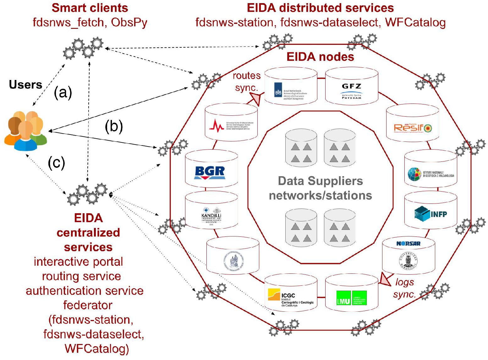

.. figure:: _static/eidalogo.jpg
  :width: 400

Introduction
============

EIDA, an initiative within ORFEUS, is a distributed federation of data centres established to securely archive seismic waveform data and metadata gathered by European research infrastructures, and provide transparent access to data for the geosciences research communities. EIDA's organization and management is handled by the EIDA Management Board (EMB). The EIDA nodes are data centres that collect and archive data from seismic networks deploying broad-band sensors, short period sensors, accelerometers, infrasound sensors, and other geophysical instruments.

Currently EIDA comprises 12 data archives that are called :ref:`nodes`. Please visit the website for all public available information on EIDA: http://www.orfeus-eu.org/eida.
