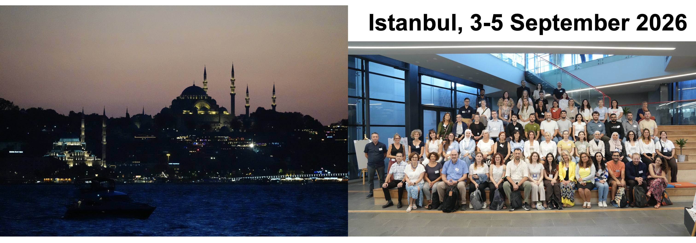
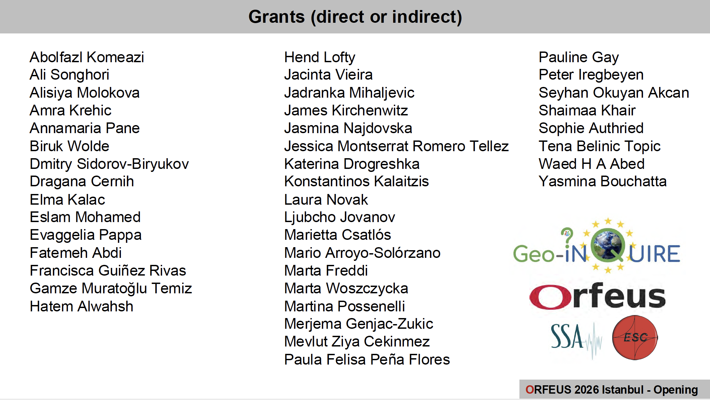

ORFEUS+Geo-INQUIRE+YSTC Workshop 2026
=====================================

**Multi-hazard, cross-disciplinary science and data services: from engineering & near-fault seismology to tsunamis**

The workshop was held in Istanbul on 3–4-5 September 2026, at the Kandilli Campus of Boğaziçi University. The workshop was organised as an integrated component of the Peter Bormann Young Seismologist Training Course (YSTC) in Istanbul, just before the ESC General Assembly.

* Workshop program: https://polybox.ethz.ch/index.php/s/QxK6Yo5Z2Xg4KZt
* Digital archive of slides and posters: https://polybox.ethz.ch/index.php/s/W24cAy8M9GX4KCB
* List of attendees: https://polybox.ethz.ch/index.php/s/sNDHxXpE3G5mkS8

Some overall statistics (based on the registration form for on-site attendance):

- 56% early career scientists (ECS)
- 57% women (F)
- 56% affiliations in EU Widening (W) countries and Associated (A) countries with equivalent characteristics in terms of R&I perform$

About the grantees:

We warmly thank the YSTC organisers at METU (Middle East Technical University) and KOERI (Kandilli Observatory and Earthquake Research Institute), as well as our local hosts at the Kandilli Campus of Boğaziçi University, for making it possible to plan this joint event.
